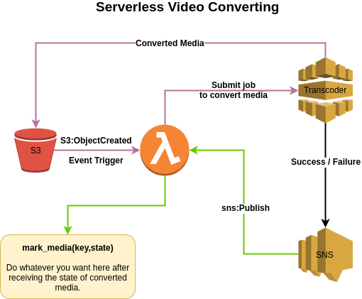

# Serverless Video Converting using AWS ElasticTranscoder & LAmbda

# How It Works
<p align="center">
 
</p>

# How To Deploy
```
# Change these variables
INPUT_BUCKET=transcoder-input-bucket
OUTPUT_BUCKET=transcoder-output-bucket
REGION=eu-west-1
SNS_TOPIC_NAME=transcoder-sns-topic

# Create S3 Buckets 
aws s3api create-bucket \
    --bucket $INPUT_BUCKET \
    --region $REGION --create-bucket-configuration LocationConstraint=$REGION \
    --acl public-read

aws s3api create-bucket \
    --bucket $OUTPUT_BUCKET \
    --region $REGION --create-bucket-configuration LocationConstraint=$REGION \
    --acl public-read

# Create SNS Topic
aws sns create-topic \
    --name $SNS_TOPIC_NAME

# Create AWS ElasticTranscoder
SNS_ARN=`aws sns list-topics | grep $SNS_TOPIC_NAME | awk '{print $NF}' | sed 's/"//g'`
aws elastictranscoder create-pipeline \
    --name transcoder-development-01 \
    --input-bucket $INPUT_BUCKET \
    --output-bucket $OUTPUT_BUCKET \
    --notifications Completed=$SNS_ARN,Warning="",Progressing="",Error=$SNS_ARN

# Create VirtualEnv
virtual env
source env/bin/activate

# Install Requirements 
pip install -r requirements.txt

# Deploy Zappa Project
# Edit zappa_settings.json ( SNS ARN, S3 Bucket )
zappa deploy production
```
